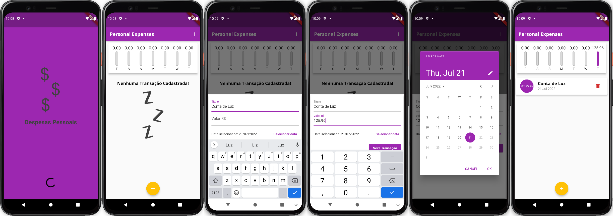

<p align="center">
  DESPESAS PESSOAIS
</p>

<h2 align="center">Tópicos 📋</h2>

   <p>
   
   - [Sobre 📖](#sobre-)
   - [Layout 🎨](#layout-)
   - [Como Usar 🤔](#como-usar-)
   - [Próximos passos 📖](#prox-passos-)

   </p>

---

<h2 align="center">Sobre 📖</h2>
   
<p>
   O projeto DESPESAS PESSOAIS está sendo desenvolvido com base nas aulas do curso de Flutter da Cod3r. <br>
   Despesas Pessoais se trata de um app mobile feito em Flutter para gerenciar os gastos semanais, onde é possível fazer o lançamento de todos os gastos, colocando o nome, o valor e data da respectiva despesa. Com isso, o gráfico presente na parte superior da tela principal vai sendo preenchido com o percentual do valor gasto no respectivo dia em relação ao valor gasto na semana. <br>
</p>

---

<h2 align="center">Layout 🎨</h2>

   <p align="center">
      
   </p>

   <p align="center">
      Visão geral das telas de Splash e da tela Principal.
   </p>

---

<h2 align="center">Como Usar 🤔</h2>

```
- Clone esse repositório:
$ git clone https://github.com/RamonTadeuGoncalves/ExpensesApp.git

- Entre no diretório:
$ cd ExpensesApp

- Instale as dependências:
$ flutter pub get

- Inicie o app:
$ flutter run
```

---

<h2 align="center">Próximos passos 📖</h2>

<p>
   Fazer login social e integração com banco de dados. <br>
   Cadastro de boletos e contas por meio da câmera do celular. <br>
   Notificar o usuário sempre que o mês estiver para fechar e/ou algum boleto estiver para vencer. <br>
</p>

<br>

---

> Esse projeto está desenvolvido com ❤️ por mim **[Ramon Tadeu Gonçalves](https://www.linkedin.com/in/ramon-gon%C3%A7alves-a900bb190/)** <br>
> com instruções do curso de Flutter da Cod3r
> **[Cod3r](https://www.cod3r.com.br/)**.<br>

---
